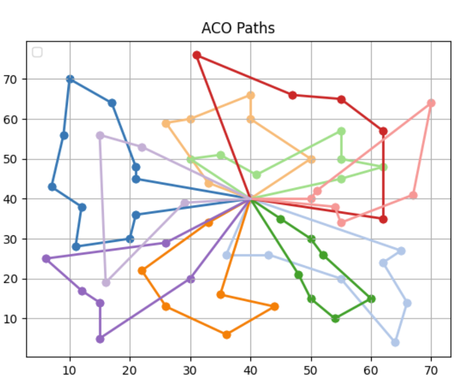

# ACO_mTSP
This is the source code of the Ant Colony Optimization applied for Multi-robot Task Allocation problem under capacity constraints.

To run the program, dowload all the source code and run "main.m" in python

Below are visualizations of the ACO_mTSP algorithm for the scenario of 65 tasks, 10 agents:
